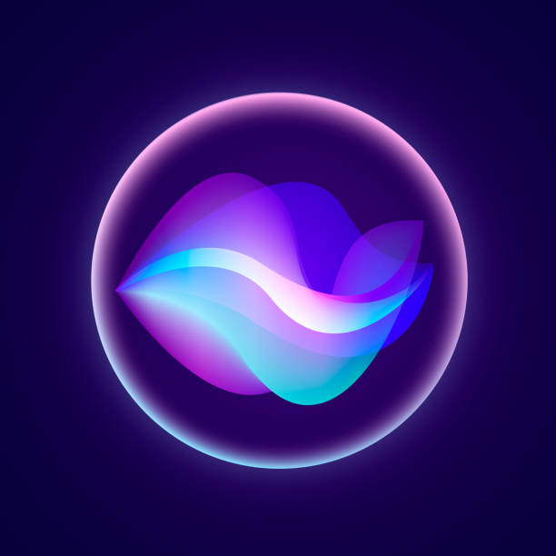

# 🔍 Lens

<p align="center">
  <strong>The Anti-Recall: On-Demand, Zero-Surveillance, 100% Local Screen Intelligence.</strong>
</p>

<p align="center">
  
</p>

<p align="center">
  <a href="#features"></a>
  <a href="#privacy"></a>
  <a href="https://ollama.com"></a>
  <a href="LICENSE"></a>
</p>

---

## ⚡ What is Lens?

**Lens** is a lightweight, privacy-first desktop HUD that instantly understands whatever is on your screen—without sending a single byte to the cloud.

Whether you're debugging a cryptic compiler error, reviewing complex code, or parsing dense documentation, hit **`Alt + L`** to summon a sleek, Raycast-inspired command HUD that **streams real-time solutions, code fixes, and explanations directly over your active window**.

> **No 24/7 background recording.**
> **No cloud telemetry or API subscriptions.**
> **Runs completely on your local machine via Ollama.**

---

## 📊 Why Lens? (The Comparison)

| Feature | 🔍 Lens | 🪟 Windows Recall | ☁️ Cloud AI (Copilot / ChatGPT) |
| :--- | :---: | :---: | :---: |
| **Cloud Data Upload** | ❌ **Never (100% Local)** | ❌ Local | ⚠️ Yes (Sends to cloud) |
| **Continuous Recording** | ❌ **No (Only on-demand)** | ⚠️ Yes (Records 24/7) | ❌ No |
| **Disk & Battery Bloat** | 🟢 **Zero (In-memory only)** | 🔴 Heavy (Gigabytes of logs) | 🟢 Negligible |
| **Offline Operation** | 🟢 **Full (No Internet Needed)**| 🟢 Yes | 🔴 Requires Internet |
| **Screen Context Chat** | 🟢 **Interactive Multi-Turn** | ❌ Search Only | ⚠️ Manual Screenshot/Paste |
| **Code & Error Fixes** | 🟢 **1-Click Copyable** | ❌ No | 🟢 Yes |
| **Open Source** | 🟢 **MIT Licensed** | 🔴 Closed Source | 🔴 Closed Source |

---

## ✨ Features

- ⚡ **Global Summon (`Alt + L`)**: Instant intelligence on your active window without switching context.
- ✂️ **Area Snip Mode (`Alt + Shift + S`)**: Drag-and-drop selector to isolate exact code blocks, terminal logs, or charts.
- 💬 **Chat with your Screen**: Ask multi-turn follow-up questions (*"Rewrite in Rust"*, *"Why is this throwing NPE?"*).
- 👁️ **Direct Multimodal Vision**: Native support for modern vision models (**`qwen3-vl`**, **`qwen2.5-vl`**, **`gemma-vl`**, **`llama3.2-vision`**). No OCR software installation required!
- ⚡ **Ultra-Fast Zero-Thinking Mode**: Bypasses slow internal reasoning overhead on vision models for instant 1-second answers.
- 🔄 **Dynamic Model Switcher**: Seamlessly switch between installed vision and reasoning models directly from the HUD.
- 🔍 **Tesseract OCR Fallback**: Automatically falls back to OCR if you prefer lightweight text models like **`deepseek-r1:8b`** or **`llama3.2:3b`**.
- 🧠 **DeepSeek Reasoning Viewer**: Collapsible thinking drawer lets you inspect model logic before the final answer.
- 🎨 **Raycast-Grade Command HUD**: Glassmorphic translucent dark UI, token-by-token streaming, Markdown rendering, syntax-highlighted code blocks with 1-click copy buttons, and persistent conversation threads.
- 🛡️ **Instant Privacy Killswitch (`Ctrl + Shift + P`)**: Immediately suspends screen capture capabilities.

---

## ⌨️ Keyboard Shortcuts

| Shortcut | Action |
| :--- | :--- |
| **`Alt + L`** | **Summon Lens** on active window |
| **`Alt + Shift + S`** | **Snip Area**: Drag rectangle over specific region |
| **`Ctrl + Shift + P`** | **Toggle Privacy**: Enable / Disable capture daemon |
| **`Esc`** | **Dismiss HUD** |
| **`Enter`** | **Send Follow-up Message** in chat bar |

---

## 🚀 Quickstart (Under 2 Minutes)

### Prerequisites
1. **Python 3.10+**
2. **Node.js 20+**
3. **[Ollama](https://ollama.com)** installed and running locally.

### 1. Clone & Pull Model
```bash
git clone https://github.com/Rushu-Tushu/Lens.git
cd Lens

# Pull your preferred vision or text model
ollama pull qwen3-vl:8b
# Or for text reasoning: ollama pull deepseek-r1:8b
```

### 2. Install Dependencies
```bash
# Set up Python observer
cd assistant-observer
python -m venv venv
venv\Scripts\activate       # On macOS/Linux: source venv/bin/activate
pip install -r requirements.txt
cp .env.example .env

# Set up Electron desktop client
cd ../assistant-electron
npm install
cp .env.example .env
```

### 3. Launch Lens
```bash
cd assistant-electron
npm start
```
*(The Electron app automatically launches and manages the background Observer daemon!)*

---

## 🏗️ Architecture

```text
┌───────────────────────────────────────────────────────────┐
│                 Electron Desktop Client                   │
│   • Global Shortcuts (Alt+L, Alt+Shift+S)                 │
│   • Glassmorphic Streaming HUD (popup.html)               │
│   • Interactive Snip Area Selector (snip.html)            │
└─────────────────────────────┬─────────────────────────────┘
                              │ Server-Sent Events (SSE)
                              ▼
┌───────────────────────────────────────────────────────────┐
│              Flask Observer Backend (:5050)               │
│   • Active Window Discovery (pygetwindow)                 │
│   • Screen / Region Capture (mss)                         │
│   • Direct Vision Pipeline (Base64 JPEG)                  │
│   • Fallback OCR Engine (pytesseract)                     │
│   • Session Conversation Memory                           │
└─────────────────────────────┬─────────────────────────────┘
                              │ HTTP Streaming (/api/generate)
                              ▼
┌───────────────────────────────────────────────────────────┐
│                    Ollama Local Server                    │
│   • qwen2.5-vl / qwen3-vl / gemma-vl (Multimodal)         │
│   • deepseek-r1 / llama3.2 (Text & Reasoning)             │
└───────────────────────────────────────────────────────────┘
```

---

## 🔒 Privacy & Security Commitments

1. **Loopback Only**: All communication is strictly bounded to `127.0.0.1`.
2. **Zero Disk Retention**: Screenshots and text context exist exclusively in RAM during analysis and are discarded immediately.
3. **Token Authenticated**: Frontend and backend handshake via an encrypted local authentication token (`x-assistant-token`).
4. **No Telemetry**: Lens contains zero analytic SDKs, zero user tracking, and zero external network calls.

---

## 🗺️ Roadmap

- [x] Real-time SSE token streaming
- [x] Multimodal Vision pipeline (Qwen-VL, Gemma-VL, Llama3.2-Vision)
- [x] Raycast-grade Command HUD with Markdown & syntax highlighting
- [x] Interactive follow-up chat with screen context
- [x] Area Snip selection tool (`Alt+Shift+S`)
- [x] Auto-orchestration of backend daemon from Electron
- [ ] Standalone 1-click Windows/macOS installer (`.exe` / `.dmg`)
- [ ] Voice query integration via local Whisper
- [ ] VS Code and JetBrains extension companion

---

## 📄 License

Distributed under the **MIT License**. See [LICENSE](LICENSE) for more information.
