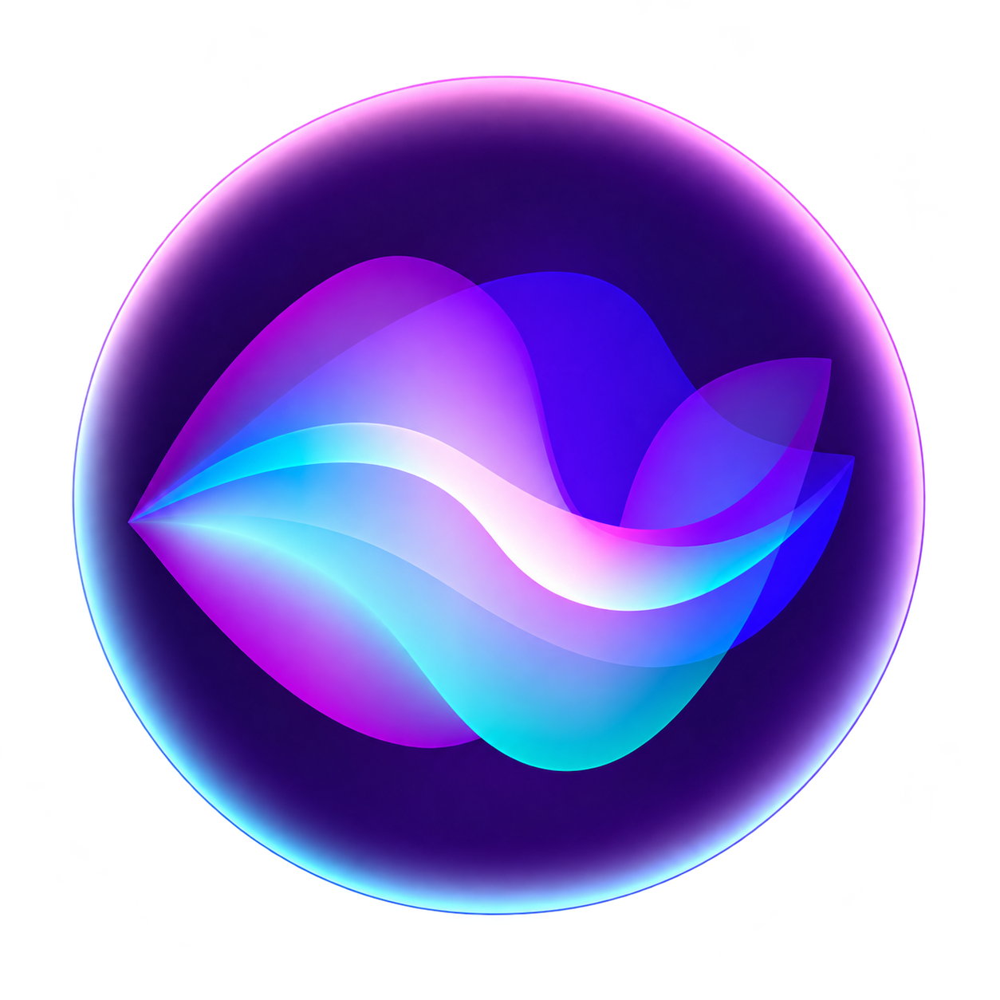

# Lens

<p align="center">
  <strong>The Anti-Recall: On-Demand, Zero-Surveillance, 100% Local Screen Intelligence.</strong>
</p>

<p align="center">
  
</p>

<p align="center">
  <a href="#features"></a>
  <a href="#privacy-and-security"></a>
  <a href="https://ollama.com"></a>
  <a href="LICENSE"></a>
</p>

---

## What is Lens?

Lens is a lightweight, privacy-first desktop overlay that understands whatever is visible on your screen without transmitting data to external servers.

When you encounter a compiler error, need complex code explained, or want a fast summary of documentation, press `Alt + L`. Lens captures the active application window in memory, runs inference locally using Ollama, and streams structured solutions directly over your workspace in real time.

Lens operates under three core principles:
* No background recording: Screen capture only activates when explicitly triggered by your keyboard shortcut.
* Zero cloud dependencies: Every token and pixel is processed on your local hardware.
* Ephemeral memory: Captured screen frames live exclusively in RAM during model inference and are discarded immediately afterward.

---

## Comparison: Lens vs Windows Recall vs Cloud AI

| Feature | Lens | Windows Recall | Cloud AI (Copilot / ChatGPT) |
| :--- | :--- | :--- | :--- |
| Cloud Data Upload | None (100% Local) | Local storage | Yes (Transmits to cloud) |
| Continuous Recording | No (On-demand only) | Yes (Logs every few seconds) | No (Manual input) |
| Disk Footprint | Zero (RAM only) | Heavy (Multi-gigabyte database) | Negligible |
| Offline Operation | Full (No network needed) | Yes | No (Internet required) |
| Screen Context Chat | Interactive Multi-Turn | Search only | Manual screenshot attachment |
| Code and Error Fixes | 1-Click Copyable | No | Yes |
| Software License | Open Source (MIT) | Closed Source | Closed Source |

---

## Features

* Global Summon (`Alt + L`): Analyzes the current active application window without stealing focus or switching contexts.
* Area Snip Mode (`Alt + Shift + S`): Drag a rectangular bounding box across any screen region to isolate specific terminal logs, stack traces, or UI designs with automatic high-DPI scaling.
* Direct Multimodal Vision: Native integration with local vision models such as `qwen3-vl:8b`, `qwen2.5-vl`, `gemma-vl`, and `llama3.2-vision`. Screen pixels are passed directly to Ollama without requiring optical character recognition software.
* Ultra-Fast Fast Mode: Automatically suppresses unnecessary internal thinking loops on vision models, reducing time-to-first-token from 30 seconds down to approximately 1.2 seconds.
* In-HUD Model Switcher: Switch between installed Ollama models directly from the title bar dropdown without restarting the application.
* Persistent Conversation History: Ask follow-up questions regarding the current screen context with a persistent message thread.
* Collapsible Reasoning Drawer: Inspect internal reasoning traces when using thinking models like DeepSeek R1 inside an expandable drawer before reading the final answer.
* Optical Character Recognition Fallback: Automatically falls back to Tesseract OCR when text-only models like `llama3.2:3b` are selected.
* Desktop Command HUD: Translucent glassmorphic interface with Markdown rendering, syntax highlighting for code blocks, and 1-click copy buttons.
* Hardware Privacy Killswitch (`Ctrl + Shift + P`): Instantly pauses or resumes all screen capture capabilities.

---

## Keyboard Shortcuts

| Shortcut | Action |
| :--- | :--- |
| `Alt + L` | Summon Lens on the active application window |
| `Alt + Shift + S` | Activate Snip mode to select a screen area |
| `Ctrl + Shift + P` | Toggle Privacy mode (Enable or disable capture daemon) |
| `Esc` | Close or dismiss the HUD overlay |
| `Enter` | Submit a follow-up query in the chat bar |

---

## Quickstart

### Prerequisites
1. Python 3.10 or later
2. Node.js 20 or later
3. Ollama installed and running locally

### Option 1: 1-Click Automated Setup (Windows)

Clone the repository and run the automated setup script:

```bash
git clone https://github.com/RuSapkal69/Personal_AI_Assistant.git
cd Personal_AI_Assistant

# Pull your preferred vision model
ollama pull qwen3-vl:8b

# Run automated setup
setup.bat

# Launch Lens
run.bat
```

The `run.bat` launcher automatically verifies dependencies, starts the Ollama service if idle, launches the Python observer daemon, and opens the desktop HUD.

### Option 2: Manual Setup (All Platforms)

1. Set up the Python Observer daemon:
```bash
cd assistant-observer
python -m venv venv

# Windows:
venv\Scripts\activate
# macOS / Linux:
# source venv/bin/activate

pip install -r requirements.txt
cp .env.example .env
```

2. Set up the Electron desktop client:
```bash
cd ../assistant-electron
npm install
cp .env.example .env
```

3. Launch Lens:
```bash
npm start
```

The Electron client automatically starts and manages the background Python observer daemon.

---

## Architecture

Lens uses a modular, three-tier local architecture:

```text
+-----------------------------------------------------------+
|                 Electron Desktop Client                   |
|   - Global Shortcuts (Alt+L, Alt+Shift+S)                 |
|   - Glassmorphic Streaming HUD (popup.html)               |
|   - Interactive Area Snip Selector (snip.html)            |
+-----------------------------+-----------------------------+
                              | Server-Sent Events (SSE)
                              v
+-----------------------------------------------------------+
|              Flask Observer Daemon (Port 5050)            |
|   - Active Window Discovery (win32gui / pygetwindow)      |
|   - Pixel Capture (mss, auto-scaled to 1920px max)        |
|   - Dual-Engine Router (Multimodal Base64 / OCR Fallback) |
|   - Multi-Turn Session Memory                             |
+-----------------------------+-----------------------------+
                              | HTTP Streaming (/api/chat)
                              v
+-----------------------------------------------------------+
|                    Ollama Local Server                    |
|   - Multimodal Vision: qwen3-vl, qwen2.5-vl, gemma-vl     |
|   - Text Reasoning: deepseek-r1, llama3.2                 |
+-----------------------------------------------------------+
```

---

## Privacy and Security Commitments

1. Loopback Binding: All client-daemon communication is strictly bound to `127.0.0.1`.
2. In-Memory Processing: Screenshots and extracted text exist only in RAM during model inference and are discarded immediately. No image files are written to disk unless explicitly enabled in configuration.
3. Token Authentication: The desktop client and background daemon authenticate every HTTP and SSE request using a shared local token (`x-assistant-token`).
4. Zero Telemetry: Lens contains no tracking SDKs, analytical collectors, or external network calls.

---

## Configuration

Both components can be configured through environment variables:

### assistant-observer/.env
```env
ASSISTANT_TOKEN=local_secret_token
OLLAMA_BASE_URL=http://127.0.0.1:11434
OLLAMA_MODEL=qwen3-vl:8b
PORT=5050
```

### assistant-electron/.env
```env
ASSISTANT_TOKEN=local_secret_token
ASSISTANT_OBSERVER=http://127.0.0.1:5050
```

---

## License

Distributed under the MIT License. See [LICENSE](LICENSE) for details.
